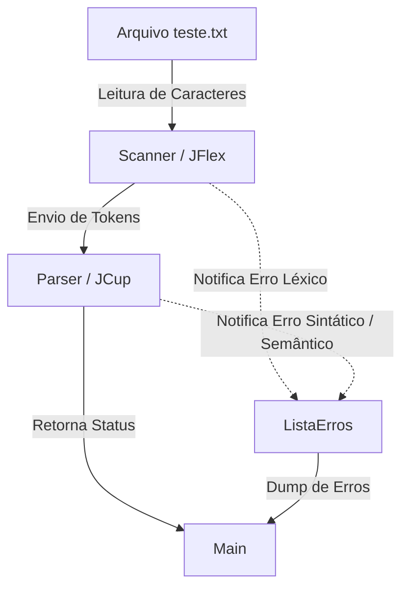

# Documentação: Analisador Léxico e Sintático (Scanner e Parser)

## 5.1 Título
**Trabalho Prático: Construção de Analisador Léxico e Sintático com Tratamento de Erros para a Linguagem Java--**

---

## 5.2 Visão Geral

O presente trabalho teve como objetivo o desenvolvimento progressivo de um Analisador Léxico (Scanner) e um Analisador Sintático (Parser) baseados na gramática da linguagem Java--. O projeto foi construído utilizando as ferramentas **JFlex** (gerador de analisadores léxicos) e **JCup** (gerador de analisadores sintáticos LALR).

Ao longo do desenvolvimento, o sistema evoluiu do simples reconhecimento de operações matemáticas básicas (soma, subtração, precedência de operadores) para a capacidade de processar declaração de variáveis, leitura de vetores, estruturas de controle de fluxo (`if`, `else`) e malhas de repetição (`while`, `for`, `do-while`). 

Além do reconhecimento estrutural, o compilador conta com um robusto sistema de **Tratamento e Recuperação de Erros**. Ele não apenas aborta em falhas, mas as coleta (erros léxicos, sintáticos e semânticos) sem interrupção abrupta, exibindo um relatório com linha e coluna no final da execução.

### Módulos e Interdependências
* **Main:** Ponto de entrada do sistema. Instancia a `ListaErros`, abre o arquivo de texto, inicializa o Scanner, e executa o Parser. Ao final, imprime o relatório de compilação ou a lista de erros.
* **Scanner (JFlex):** Lê o arquivo fonte caractere por caractere, ignorando espaços em branco e reconhecendo agrupamentos válidos (Lexemas) para convertê-los em *Tokens*. Caso encontre um caractere não mapeado, emite um erro léxico.
* **Parser (JCup):** Recebe os *Tokens* do Scanner e valida a estrutura lógica e hierárquica baseada nas regras de produção. Caso identifique tokens fora de ordem, aplica regras de recuperação de erro (usando o símbolo `error`) e continua a análise.
* **Pacote de Erros (Erro e ListaErros):** Módulo global instanciado no `Main` e repassado ao `Scanner` e `Parser` para armazenar a localização (linha e coluna) e a mensagem de cada erro encontrado.

**Diagrama de Inter-relações:**

---

## 5.3 Tokens e Expressões Regulares

### 5.3.1 Tabela de Tokens Válidos

| Lexema | Expressão Regular | Atributo / Token (JCup) |
| :--- | :--- | :--- |
| **Números Inteiros** | `[0-9]+` | `NUMBER` (Integer) |
| **Números Reais** | `[0-9]+"."[0-9]+` | `NUMBER` (Double) |
| **Identificadores** | `[a-zA-Z]([a-zA-Z]\|[0-9])*` | `IDENT` (String) |
| **Op. Relacionais** | `">" \| "<" \| ">=" \| "<=" \| "==" \| "!="` | `OP_RELACIONAL` (String) |
| **Op. Matemáticos** | `"+" \| "-" \| "*" \| "/" \| "%"` | `MAIS`, `MENOS`, `MULT`, `DIV`, `MOD` |
| **Atribuição** | `"="` | `IGUAL` |
| **Símbolos de Escopo**| `"{" \| "}" \| "(" \| ")" \| "[" \| "]"` | `ABRE_CHAVE`, `FECHA_PARENT`, etc. |
| **Sinais Gráficos** | `";" \| "." \| ","` | `PTVIRG`, `PTO`, `VIRG` |
| **Espaços/Quebras** | `\r \| \n \| \r\n \| [ \t\f]` | *(Desprezados / Sem token)* |

*(Nota: O Scanner também foi programado para reconhecer a regra "Fallback" `[^]` como Erro Léxico, não gerando um token válido).*

### 5.3.2 Palavras Reservadas

| Palavra Reservada | Token Gerado |
| :--- | :--- |
| `program` | `KW_PROGRAM` |
| `if` | `KW_IF` |
| `else` | `KW_ELSE` |
| `while` | `KW_WHILE` |
| `for` | `KW_FOR` |
| `do` | `KW_DO` |
| `true` | `KW_TRUE` |
| `false` | `KW_FALSE` |

### 5.3.3 Autômato Finito Determinista (AFD)

O JFlex atua convertendo as Expressões Regulares listadas acima em um AFD internamente. De forma simplificada para o grupo numérico e de identificadores, o comportamento de transição obedece a lógica:
1. **Estado Inicial (S0):** Ao ler um dígito `[0-9]`, transita para o estado **S1**. Ao ler uma letra `[a-zA-Z]`, transita para **S3**.
2. **Estado S1 (Inteiros):** Enquanto ler `[0-9]`, permanece em S1 (Estado de aceitação de Inteiro). Se ler um ponto `.`, transita para **S2**.
3. **Estado S2 (Reais):** Requer pelo menos um dígito `[0-9]` após o ponto. Enquanto ler `[0-9]`, permanece em S2 (Estado de aceitação de Real).
4. **Estado S3 (Identificadores):** Aceita letras e números. Qualquer sequência mantém no estado S3 (Estado de aceitação de Identificador ou Palavra Reservada, resolvida posteriormente pela tabela de símbolos).

---

## 5.4 Resultados

O compilador foi submetido a diversos arquivos de testes (como `teste.txt`) a cada iteração do desenvolvimento para provar a consolidação das funcionalidades exigidas. 

**Testes Relevantes Executados:**
1. **Manipulação de Variáveis e Vetores:** A gramática testou com sucesso a leitura estrutural de arrays (`vetor[4] = 10;`) e manipulação de variáveis combinadas (`4 + a;`).
2. **Estruturas Condicionais:** Foram avaliadas blocos `if(true)` e `if(false)` acoplados a um `else`. A lógica global testou o comportamento em que, se a condição avalia para falso, os nós internos deixam de ser "impressos" visualmente pelo AST temporário construído via variável boolean `deveExecutarBloco`.
3. **Estruturas de Repetição:** O funcionamento do `while`, do `for(inicio; condicao; passo)` e do `do-while` foram processados e reconhecidos corretamente pela gramática do JCup sem causar ambiguidades na hierarquia LALR.
4. **Resiliência e Recuperação de Erros:** O teste principal focou em corromper o arquivo com Símbolos não mapeados (como `@`), Divisões por Zero (erro semântico) e expressões ausentes de operadores sintáticos. O Scanner provou sua resiliência listando com perfeição as linhas e colunas exatas da falha sem quebrar a execução do programa em nenhum momento.

---

## 5.5 Conclusão

A construção de um compilador iterativo permitiu compreender o papel essencial da abstração entre a leitura de caracteres em texto plano (Scanner) e a verificação estrutural (Parser). 

**Características Especiais e Extensões Implementadas:**
* **Simulação de Execução sem AST:** Foi utilizada a técnica inteligente de controle de fluxo de estado (`deveExecutarBloco`) acoplada no `parser.cup` para simular a execução controlada de blocos lógicos (`if/else` e laços de repetição) apenas durante o processo top-down, sem a necessidade da criação de uma Árvore Sintática Abstrata (AST) madura.
* **Recuperação Sintática com o Símbolo `error`:** Diferente de mapear regras explicitamente erradas e engessar a gramática, foi implementado o símbolo especial curinga `error` nativo do CUP, junto da sobrescrita do método `syntax_error(Symbol s)`. Isso permitiu que o parser entrasse em "panic mode" ao identificar um erro no meio de uma estrutura complexa (ex: `while` sem parênteses), reportasse a linha no sistema global de erros, e se recuperasse sincronizando no próximo token chave.

A evolução técnica da disciplina mostra que um compilador robusto não é apenas aquele que compila códigos certos, mas o que consegue guiar o programador com elegância em meio a códigos errados.

---

## 5.6 Referências Bibliográficas

* HAUCK, Alessandra. *Material e Roteiros de Aula Prática (1 ao 10) - Compiladores*.
* Manual Oficial do JFlex. Disponível em: https://jflex.de/manual.html
* Manual Oficial do CUP (LALR Parser Generator for Java). Disponível em: http://www2.cs.tum.edu/projects/cup/manual.html
